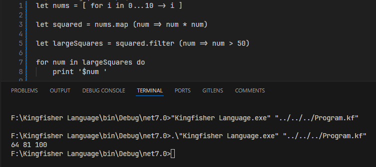

# The Kingfisher Programming Language
Kingfisher is a programming language designed with built-in syntax for an entity component system with modern features, inspired by F#, Swift, and Haxe. Some features of the language include:
- Everything is an expression
- Support for custom types (records, discriminated unions, tuples)
- Flexible whitespace-based syntax
- ECS without any extra libraries


 The specification file details the syntax of the language, and the grammar file has the specific grammar used to parse the language.

## Current State
The majority of the language is functional, including control flow, custom type declarations, and any ECS-related syntax. In its current state, the language does not have tuples or complex pattern matching implemented, but the rest of the features listed in the specification file should work. Kingfisher is compiled to Haxe, so in order to run a Kingfisher program, one will need the Haxe compiler installed.

## Sample Program


## Other Sample Code
```
fun add a b = a + b
add 3 4

let arr = [-2, 5, 9]
when arr is
    [2, 4, 6] -> println 'Counting by twos'
    [a, b, c] where a < b && b < c -> println 'Its ascending'
    [_, _, _] -> println 'Out of order'

for e in arr do
    if e % 2 = 0 then println e 
    else println 'Odd number'

// ECS 

// Entities
ent player = Transform PlayerController
ent 10 = Transform Collider

// Components
com Transform =  
    position: Vec3
    rotation: Vec3
    scale: Vec3
Transform@player

// System
sys Transform Enemy | Update =
    if keyPressed Key.Left then Transform.position.x <-+ 1
```